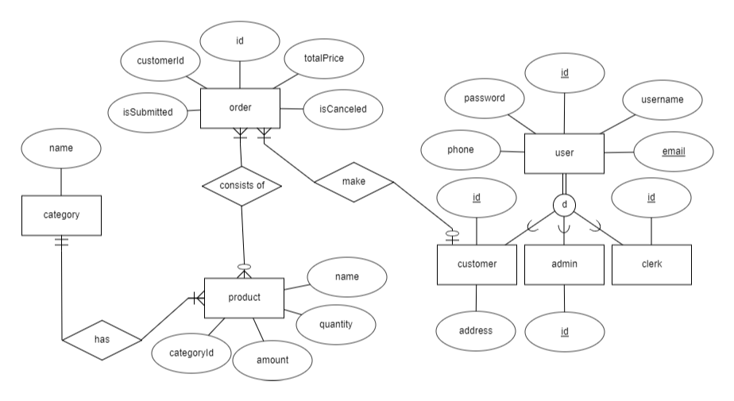

# Ecommerce REST API

A simple ecommerce restful api using JAX-RS.


## Documentation

[Postman RESTful API](https://documenter.getpostman.com/view/10348227/UyxdMA8V)


## Features

- Registration and login
- Add product  ```clerk & admin```
- Edit product ```clerk & admin```
- Delete product ```clerk & admin```
- View product details
- View products
- Search for product by name and category
- Make an order
- Confirm customers' order ```clerk & admin```
- View order by id ```clerk & admin```
- View order by customer id
- View all orders ```clerk & admin```
- Cancel order
- View all clerks ```admin```
- View clerk by id ```admin```
- Edit clerk ```admin```
- Delete clerk ```admin```
- Add clerk ```admin```


## Technologies Used

- JAX-RS (Jersey)
- JSON-B
- JAX-B
- Maven
- Lombok
- Tomcat
- Jakarta persistance (Hibernate)
- MySql
- Postman


## Entity-Relationship Diagram

<p align="center">
  
</p>

## Database Schema

## Run Locally

Clone the project

```bash
  git clone https://github.com/amiraElmergawy/ECommerce-REST-API
```

Go to the project directory

```bash
  cd ECommerce-REST-API
```

- Create db user and set the username and password values in the persistence.xml
- Create db named e-commerce in your MySql Server
- Run your tomcat apache server and then change the configuration of tomcat in pom.xml
- Deploy the application using the following maven command


```bash
    mvn clean package tomcat7:deploy
```
